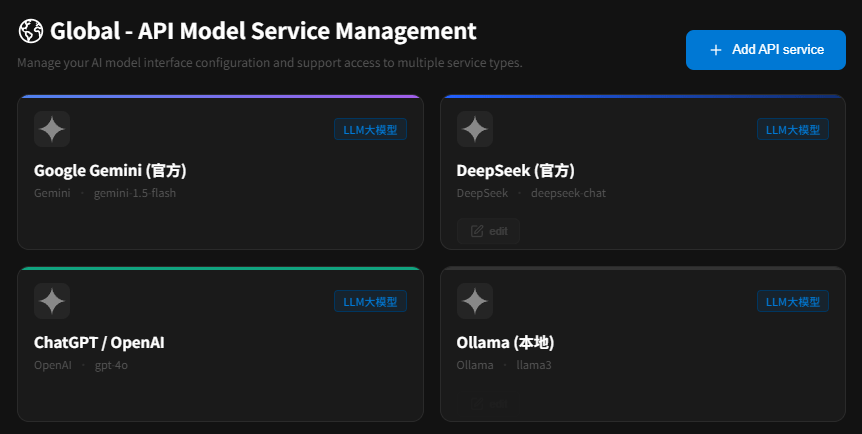
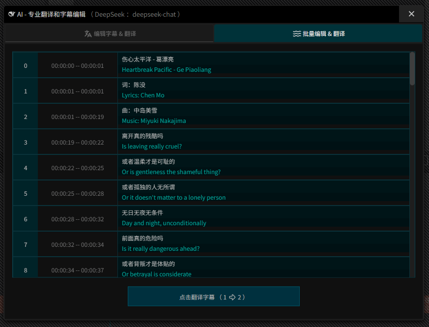
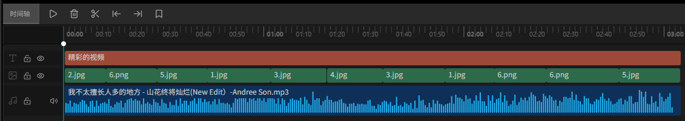

  
  <h1>ComeCut 「来剪」</h1>
  
<b>免费、开源、AI 驱动的全平台视频编辑工具（网页版 & 桌面版）</b>

  

    
    
    
    
  

  <h3>
    <a href="README.md">English</a> | <a href="README_ZH.md">简体中文</a>
  </h3>

---

  

## 🎁 为什么选择 ComeCut?

我们的愿景是：充分整合开源社区的力量，打造一个真正免费、开放、可扩展的 AI 视频编辑生态系统，惠及所有人。

*   ✅ **完全免费**：无任何使用限制，无隐藏付费。
*   🚀 **无需注册**：即开即用，保护您的使用隐私。
*   🔒 **本地安全**：数据完全本地化处理，安全可靠。
*   🤖 **AI 赋能**：深度集成前沿 AI 模型。
*   🎨 **功能强大**：提供媲美专业软件的视频编辑体验。

---

## ✨ AI 驱动的生态系统

### 🌐 支持全球 100+ API 大模型
ComeCut 接入了全球顶尖的 AI 能力，让您在剪辑过程中随时调用最强的生成式 AI。

  

### 📝 AI 字幕翻译 (SRT/VTT/LRC)
双语字幕一键翻译，支持多种格式，让跨语言创作变得轻而易举。

  

  

---

## 🗺️ 路线图 (进行中)

- [ ] 🎙️ **AI 语音识别**：自动将语音轨道识别并生成字幕。
- [ ] 🎭 **AI 自由创作**：未来将接入 `Seedance-2.0`, `Veo3.1`, `Sora2` 等，轻松创作 AI 短剧/漫剧。
- [ ] 🎬 **AI 视频译制配音**：支持美剧/韩剧/日剧等一键译制成国语配音。

---

## ⚡ 在线演示

### 立即体验
无需安装，直接在浏览器中试用：
👉 **[在线演示入口](https://juntaosun.github.io/ComeCut/)**

| Windows | MacOS | Linux |
| :---: | :---: | :---: |
| ✅ Beta | ✅ Beta | ✅ Beta |

---

## 💬 交流与贡献

- 🌟 **早期阶段**：这是一个快速发展的项目，我们有许多新颖有趣的创意正在实现中。
- 💡 **反馈建议**：如果您有任何疑问或想法，欢迎通过 [Issues](https://github.com/juntaosun/ComeCut/issues) 与我们联系！
- 🤝 **参与贡献**：感谢您的关注，建议在项目进入稳定版本后再进行大规模代码贡献。

## 👏 最新动态
- **[2025-09-07]** 🚀 **ComeCut 项目正式启动！**

查看更多

...

---

## 🛡️ 隐私声明
- **无数据收集**：ComeCut 不会收集您的任何个人隐私数据。
- **本地存储**：所有创作数据均存储在您的本地浏览器或本地磁盘中。

## 🔑 许可证
版权所有 © 2025 **juntaosun** 及其他贡献者。
本程序基于 [GNU Affero General Public License v3.0](LICENSE) 协议。

> **免责声明**：ComeCut 仅用于教育学习和研究用途。请确保您的使用符合当地法律法规。

---

  <b>如果您觉得 ComeCut 对您有帮助，请点个 Star 鼓励一下！ ⭐⭐⭐⭐⭐</b>

